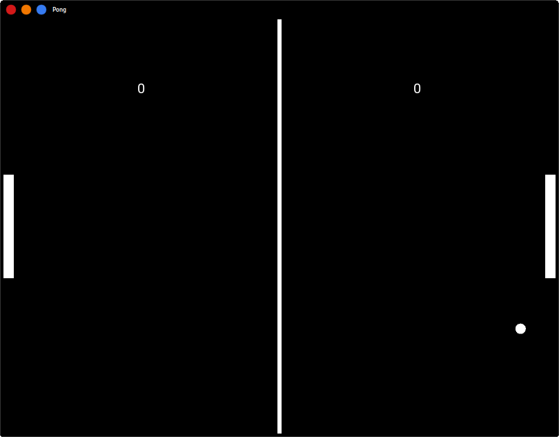

# PingPong

*Pong* is my first pyhton program/game based on [Kivy](https://kivy.org). 

# My Experience

- My first repository on kivy/python based program.

- First porgram with mouse control rather than keys which is capable of running with touchscreen.

# Future Objectives

- To convert it into **apk** for Android.

- To add more levels and fuctionality.

- Improvement in UI.

It's fun getting started with Kivy.